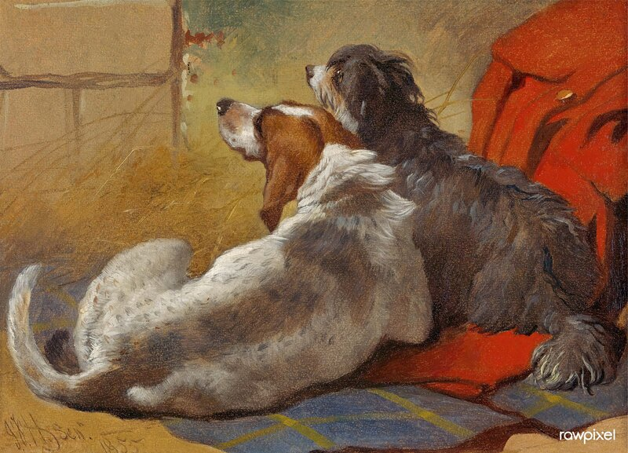

# arxiv-hound

<p>
  
</p>

A lightweight client for accessing arXiv. It is shipped as MCP, a CLI, and a TypeScript library.

## Tools

- `search`: query arXiv, enriched with Semantic Scholar TLDRs and citation counts.
- `metadata`: batch metadata for many paper IDs in one round-trip.
- `fetch`: full paper text as markdown, HTML first with ar5iv and PDF fallback.
- `similar`: papers similar to a given one, via SPECTER2 embeddings.
- `citations`: references and citers from Semantic Scholar.
- `cite`: BibTeX for any arXiv ID.

Uses a local markdown cache so repeat reads are free.

Designed to be straightforward for humans and for LLMs.

No local semantic index, no alerts, no HTTP transport, no bundled prompts.

Just core functionality: find a paper, read it, follow citations, cite it.

## arxiv-hound as an MCP server

The six tools above show up in your MCP host. Example prompt: *"Search arXiv for recent work on speculative decoding, then fetch the most-cited result and give me BibTeX for it."* The model chains `search`, then `fetch`, then `cite` without you naming them.


Install steps:

- Claude Code: `claude mcp add arxiv-hound -- npx -y arxiv-hound serve`
- Claude Desktop: download `arxiv-hound-<version>.mcpb` from the latest release, double-click.
- MCP hosts (Cursor, VS Code, Zed): drop `{"command": "npx", "args": ["-y", "arxiv-hound", "serve"]}` into their MCP config.
- Nix users: `nix run github:kanafm/arxiv-hound -- serve`.

## arxiv-hound as a CLI

The same six tools as subcommands:

- `arxiv-hound search "speculative decoding" --max 5`
- `arxiv-hound metadata 2402.08954 1706.03762`
- `arxiv-hound fetch 2402.08954`
- `arxiv-hound similar 2402.08954 --max 10`
- `arxiv-hound citations 2402.08954`
- `arxiv-hound cite 2402.08954`

Run `arxiv-hound --help` to see the full list, or `<subcommand> --help` for options.

## arxiv-hound as a library

```ts
import { searchPapers, fetchContent, toBibtex } from "arxiv-hound";

const results = await searchPapers("speculative decoding", { max: 5 });
const paper = await fetchContent(results[0].id);
const bibtex = toBibtex(results[0]);
```

## Config

Two optional env vars:
* `ARXIV_HOUND_CACHE` (cache directory, defaults to `~/.cache/arxiv-hound`)
* `ARXIV_HOUND_S2_KEY` (Semantic Scholar API key for higher rate limits, this is optional).

## Development

```
nix develop
node ./dist/cli.js -h
```

## Image credit

<sub><em>"A Hound and a Bearded Collie seated on a Hunting Coat" (1855) by John Frederick Herring, Sr. Digital enhancement by rawpixel. <a href="https://commons.wikimedia.org/wiki/File:A_Hound_and_a_Bearded_Collie_seated_on_a_Hunting_Coat_%281855%29_painitng_in_high_resolution_by_John_Frederick_Herring._Original_from_Yale_University_Art_Gallery._Digitally_enhanced_by_rawpixel._%2851928144515%29.jpg">Source</a>, <a href="https://creativecommons.org/licenses/by/2.0/">CC BY 2.0</a>. Resized and recompressed for this README.</em></sub>